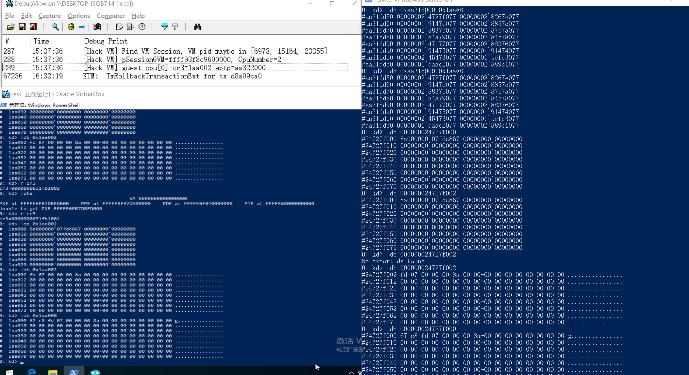
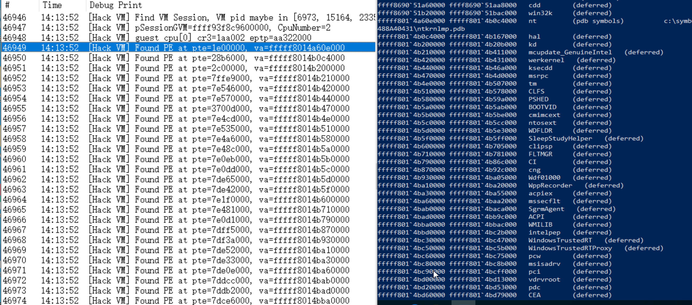
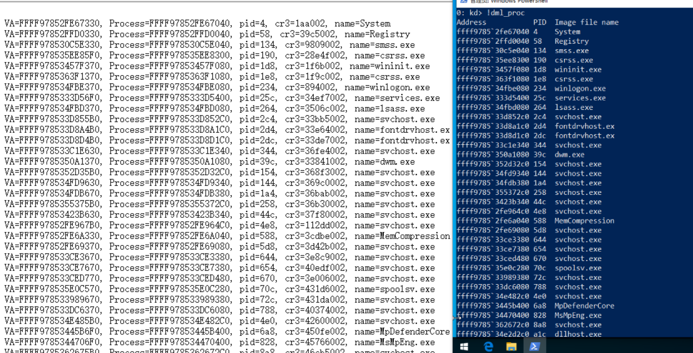

# HackVirtualBoxVM

> virtualbox: 7.7.2
> guest os: windows 10 1903 ver18363
> ntoskrnl.exe: 10.0.18362.418

## 定位 guest 的 eptp 和 cpu 的 cr3

## 在 GVA 中搜索 ntoskrnl 地址

## 通过 PsActiveProcessHead 遍历进程

