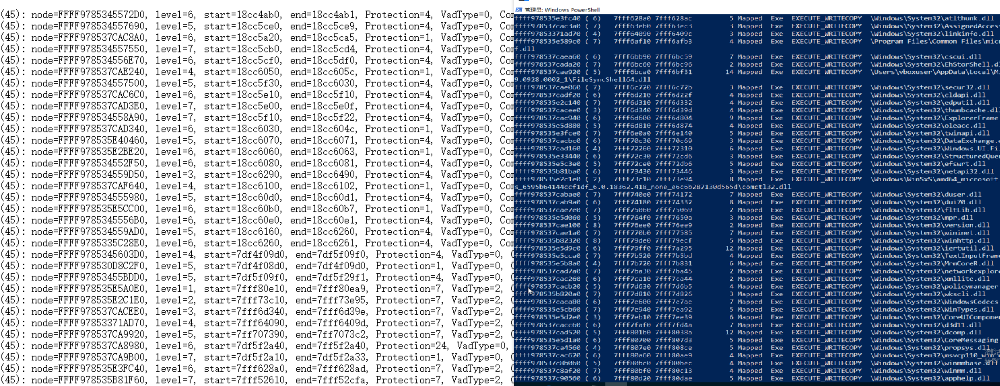

# HackVirtualBoxVM

Read VM mem on host os.

> Test only on

- virtualbox: 7.7.2
- guest os: windows 10 1903 ver18363
- ntoskrnl.exe: 10.0.18362.418

## 定位 guest 的 eptp 和 cpu 的 cr3

## 在 guest 内核内存中搜索 ntoskrnl 地址

## 通过 PsActiveProcessHead 链表遍历进程

## 指定进程 遍历虚拟内存 vad

